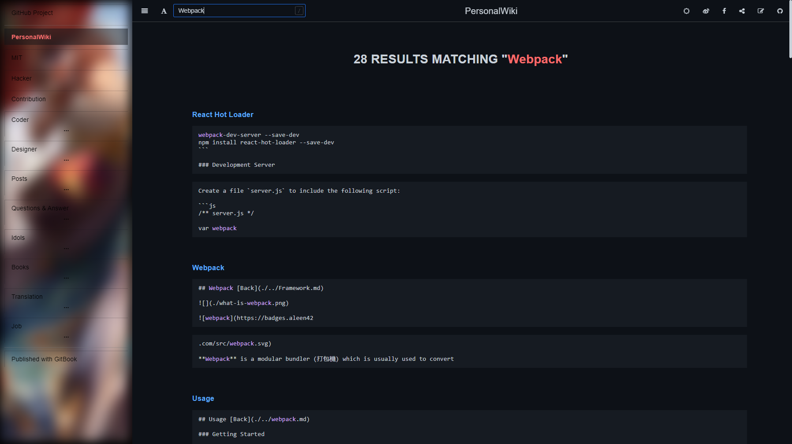

## gitbook-search

   

A Gitbook plugin to implement searching with GitHub Search API, and means that you need to deploy your Gitbook repository on GitHub before using this plugin.



### Installation

Add the following plugins to your `book.json` and run the command `gitbook install`

```json
{
   "plugins": ["github-search"]
}
```

### Usage

Because it is based on [GitHub Search](https://docs.github.com/en/rest/reference/search#search-code) API, you may need to provide an access token to avoid request limitations.

```json
{
   "plugins": [
      "github-search"
   ],
   "pluginsConfig": {
      "github-search": {
         "repo": "aleen42/PersonalWiki",
         "token": "YOUR_GITHUB_ACCESS_TOKEN"
      }
   }
}
```

### TODO

- [ ] Implement pagination
- [ ] User experience enhancement

### Release History

* ==================== **1.0.0 Initial release** ====================

### :fuelpump: How to contribute

Have an idea? Found a bug? See [how to contribute](https://wiki.aleen42.com/contribution.html).

### :scroll: License

[MIT](https://wiki.aleen42.com/MIT.html) © aleen42
